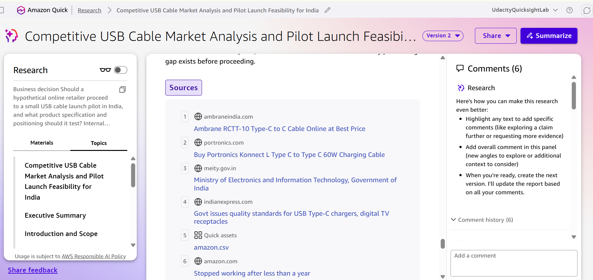
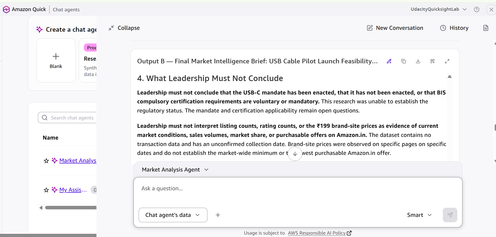

# Market Intelligence Agent in Amazon QuickSuite

A no-code market intelligence workflow that combines an internal product dataset with external research, evaluates the reliability of AI-generated insights, and produces a leadership brief.

**Author:** Nike Nsikak-Nelson  
**Outcome:** Passed the Udacity project, as reported by the author.  
**Case study:** USB cable pilot-launch feasibility on Amazon India.  
**Research period:** September 2026; the dataset collection date is unconfirmed.

## The business decision

Should a hypothetical online retailer commit inventory to a small USB cable pilot on Amazon India, and what product positioning deserves further validation?

**Recommendation:** Defer inventory commitment while validating comparable marketplace offers, customer demand, product performance, applicable requirements and full costs. The research identifies hypotheses to test; it does not establish profitable demand.

## Start here

- [Executive brief](docs/market-intelligence-brief.md): four insights, limitations and recommended actions.
- [Market analysis](docs/market-analysis.md): competitive observations and detailed reliability assessment.
- [Dataset inspection](docs/dataset-inspection.md): data structure, duplicate handling and verified baseline.
- [Reliability and lessons learned](docs/reliability-and-lessons.md): how unsupported AI claims were challenged.
- [Workflow and prompts](docs/workflow-and-prompts.md): how to rebuild the no-code process.
- [Evidence and sources](docs/evidence-and-sources.md): screenshots and source attribution.
- [Dataset reference](data/README.md): download and scope information.

## Workflow

1. Frame the business question, scope, constraints and decision criteria.
2. Upload the original Kaggle CSV to a Space and connect it to a custom chat agent.
3. Inspect the full dataset and reconcile inconsistent outputs.
4. Use Quick Research to collect focused external competitor and customer signals.
5. Ask the agent to synthesize the dataset and research into a Market Analysis.
6. Assess each insight's source quality, consistency, timeliness and confidence.
7. Produce a leadership brief and organize the evidence in the Space.

**Tools used:** Amazon QuickSuite Spaces, Quick Research and a custom Market Analysis Agent with Quick Chat. This repository documents the no-code workflow and its outputs. Rebuilding the agent requires an appropriately provisioned QuickSuite account; there is no executable application or deployed agent in this repository.

## Internal baseline

| Measure | Verified observation |
|---|---:|
| Full dataset rows | 1,465 |
| Full dataset columns | 16 |
| Distinct products in full dataset | 1,351 |
| USB cable rows | 233 |
| Distinct USB cable products | 161 |
| Median recorded USB cable selling price | ₹299 |
| Products recorded below ₹400 | 124 of 161 (77.0%) |
| Median recorded rating | 4.2 |

These are undated sample statistics covering multiple connector types. They are not current market estimates, sales figures or a census. The reproducible baseline retains the first occurrence of each product ID in original file order; first does not mean newest.

## What this project demonstrates

- Turning a broad business question into a bounded research objective.
- Combining internal data with external research while preserving source distinctions.
- Detecting duplicate records, invalid values and unsupported inferences.
- Separating observable evidence from commercial hypotheses.
- Communicating uncertainty and decision conditions to leadership.

## Workflow evidence

### Completed Quick Research

### Agent-generated executive brief

Screenshots demonstrate the workflow. They do not independently validate every market claim.

## Portfolio edition

The Markdown reports are portfolio adaptations of the project documents. They incorporate the final editorial corrections discussed during review; they are not represented as byte-for-byte copies of the graded submission. Reusable prompts are reconstructed from the workflow rather than exported chat transcripts.

External observations remain attributed to the original research period and have not been refreshed for publication. Raw reviewer records, private lab links, account-management screenshots, grading templates and superseded drafts are not part of this portfolio. See [sources and attribution](docs/evidence-and-sources.md).
